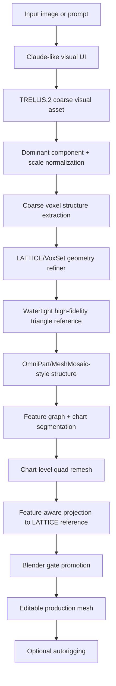

# LATTICE Reproduction Plan

Date: 2026-05-03
Paper audited: `/Users/Ashar/Downloads/2512.03052v1.pdf`
Working paper text: `/tmp/lattice_2512.03052v1.txt`
Primary target: reproduce the LATTICE geometry-refinement model family well enough to become the high-fidelity reference stage inside ClearMesh.
Related methods addendum: `/Users/Ashar/Documents/GitHub/clearmesh/docs/lattice_related_methods_addendum.md`

## Executive Verdict

Yes, we can reproduce the model directionally, and we can likely build a strong working reproduction using public components. Exact paper-level parity is not guaranteed because the official LATTICE code and training data are not released, and several method details are under-specified. The best path is not to clone a hidden repo that does not exist. The best path is to implement the missing LATTICE deltas on top of the public Hunyuan3D-2.1 training stack, using UltraShape as an open-source reference implementation and baseline.

The model is not primarily an artist-topology generator. It is a high-fidelity geometry refiner based on a semi-structured latent SDF representation. Its output should be treated as our high-quality watertight reference surface. To produce a highly editable mesh, ClearMesh still needs the downstream structure and retopology stack: part decomposition, chart-level quad remeshing, feature-aware projection, Blender gate promotion, and optional autorigging.

The critical reproduction thesis is:

```text
Coarse structure mesh from TRELLIS.2 / Hunyuan / another generator
    -> active voxel centers from voxelized coarse geometry
    -> VoxSet latent tokens anchored to those voxel centers
    -> rectified-flow DiT with 3D positional guidance
    -> SDF decoding + marching cubes / FlashVDM
    -> high-fidelity watertight triangle reference
    -> ClearMesh production retopology and editability stack
```

## Current Implementation Status

Verified on 2026-05-03:

```text
clearmesh/lattice/queries.py
clearmesh/lattice/voxelize.py
clearmesh/lattice/topology_vdf.py
clearmesh/lattice/irregular_patches.py
clearmesh/lattice/tiny_vdf.py
scripts/research/build_lattice_sample_dataset.py
scripts/research/train_lattice_vdf_tiny.py
scripts/thunder/lattice_vdf_tiny_smoke.sh
```

What works now:

```text
- active surface voxel extraction from a mesh
- query jitter bounds
- VDF samples: point + three vertex displacements + normal
- edge positive/negative candidate sampling
- deterministic face-level VDF samples for tiny overfit validation
- irregular FPS/KNN patch construction
- tiny VDF MLP training on Thunder
- best-weight checkpointing and JSON-safe checkpoint metadata
```

Thunder result:

```text
command: scripts/thunder/lattice_vdf_tiny_smoke.sh
device: cuda, RTX A6000
best_loss: 2.774e-10
predicted_mesh: /tmp/clearmesh_lattice_vdf_smoke/predicted.glb
predicted_faces: 12
predicted_vertices: 8
predicted_watertight: true
target_watertight: true
max_abs_vdf_error: 8.82e-05
```

Interpretation:

```text
This proves the local VDF representation, exporter, tolerant vertex welding,
best-checkpoint logic, and Thunder dependency path. It does not yet prove a
full LATTICE VoxSet VAE/DiT reproduction.
```

## What The Paper Actually Says

This is the line-level hostile reading of the method and appendix. Line numbers refer to the extracted PDF text in `/tmp/lattice_2512.03052v1.txt`.

| Area | Paper Lines | Claim | Reproduction Meaning |
| --- | ---: | --- | --- |
| Core representation | 15-29 | VoxSet compresses 3D assets into compact latent vectors anchored to a coarse voxel grid. | Latents must have known 3D locations. We cannot use plain unordered VecSet latents. |
| Two-stage pipeline | 22-27, 176-184 | Stage 1 generates a sparse voxelized geometry anchor; Stage 2 generates detailed geometry with a rectified-flow transformer. | TRELLIS.2 can be Stage 1. LATTICE is a refiner, not a full replacement for TRELLIS.2. |
| Why this works | 65-83 | 2D generation has fixed spatial coordinates; 3D must infer both where and what. | The whole moat is decoupling `where` from `what`. Coarse voxel centers provide `where`; DiT generates local detail latents as `what`. |
| Sparse voxel critique | 84-100 | Sparse voxels have useful structure but too many tokens and complex sparse systems. | Use voxel centers as structure but keep a transformer-friendly set representation. |
| VecSet critique | 100-123 | VecSet is compact and scalable but lacks test-time-known query positions. | Hunyuan-style VecSet is not enough; we must replace point-query latents with localizable voxel queries. |
| Voxel query definition | 151-161 | Voxel queries are center coordinates of active voxels intersecting the object surface, obtained by voxelizing a coarse generated mesh. | This is the key adapter for ClearMesh: coarse mesh -> active voxel centers -> token coordinates. |
| Progressive token scaling | 162-175, 314-329 | Start with low token counts, then scale token counts; test-time token count can be higher than training. | Validation should start tiny. We should prove token scaling before expensive training. |
| Input point cloud | 247-268 | VAE input point cloud is `N x 7`: xyz, normal, binary sharpness; uniform surface samples plus sharp-edge importance samples following Hunyuan3D-2. | Public Hunyuan3D-2.1 preprocessing is directly usable as our baseline data format. |
| Encoder/decoder structure | 314-321 | Encoder cross-attends from query tokens to point cloud, then self-attention. Decoder uses SDF grid coordinates as queries against latent tokens. | Reuse Hunyuan ShapeVAE skeleton, but replace query provider. |
| Query type | 330-343 | Point queries support arbitrary resolution but their positions are unknown at test time. | We need a query-provider abstraction: point queries for pretraining/jitter, voxel queries for diffusion/inference. |
| Query jitter | 347-358 | During VAE training, jitter point queries with uniform offset `[-1/(2R), 1/(2R)]`; test/diffusion can use voxel queries at any resolution greater than `R`. | This is the highest-value VAE reproduction detail. It bridges point-query training and voxel-query inference. |
| DiT positional guidance | 360-368 | Add RoPE to each noisy latent token using VoxSet structure. | Hunyuan3D-2.1 `HunYuanDiTPlain` only has optional 1D index position embeddings. We need 3D position/RoPE injection. |
| Random token subset | 384-393 | During DiT training, randomly sample a fixed number of structure tokens, then progressively train from 1024 to 6144. | We do not train all active voxels every step. Token subsampling is essential for cost. |
| Image conditioning | 394-407 | DINOv2-Giant, last hidden layer without class token, image resolution 1022, mask crop preserving aspect ratio, no extra image positional embedding. | Hunyuan3D-2.1 public config uses DINO-large at 518 with CLS token. We must upgrade this for parity. |
| Model sizes | 408-415, 672-676 | 0.6B, 1.9B, 4.5B models; trained up to 6144 tokens; inference can use 12288, 24576, more. | We start small, then scale. Do not jump to 4.5B until VAE and DiT ablations pass. |
| Reconstruction metrics | 408-415, 474-494 | Uses CD and F-score threshold 0.001 with meshes normalized to `[-1, 1]`; LATTICE improves with more tokens. | Our eval harness must replicate these metrics and add production/editability gates. |
| VAE ablation | 509-532 | Query Jitter is best and flexible across 64/128/256 resolutions. | Query jitter is non-negotiable; it gets its own validation milestone. |
| DiT ablation length | 547-550 | DiTs in ablation trained 200k steps: 100k at 1024 tokens and 100k at 3072 tokens. | This is the smallest paper-supported serious DiT validation schedule. |
| Training setup | 617-634 | Train 0.6B/1.9B/4.5B from scratch; no progressive model scaling; multi-stage token scaling; LR from 1e-4 to 1e-6; batch up to 2048; DeepSpeed ZeRO; linear-coupling flow matching; CFG dropout 10%. | We should copy this schedule structure, not train random one-off configs. |
| Data prep | 635-642 | Filter assets; watertighting; point-cloud sampling and SDF extraction; remove AI-generated assets, scanned assets, extreme scenes, planes; sample millions of point clouds and chunk them. | Data quality is a core hidden variable. A bad dataset will make architecture conclusions meaningless. |
| HQ finetune | 645-656 | Finetune all DiT parameters on roughly 15k high-quality samples filtered by faces, sharp edges, and reconstruction quality. | This is likely a major quality source and not reproducible exactly without private data. We can create our own curated HQ set. |
| Acceleration | 658-663 | FlashVDM for VAE decoding; guidance and step distillation for fewer steps. | Production needs this. Raw 50-step DiT plus high-res decoding is likely too slow. |

## Public Code Audit

### LATTICE Official Repo

The official LATTICE repository currently has no released implementation. Its README says open-source is on hold and recommends Hunyuan3D-2.1 training code, HY3D-Bench, and UltraShape as the practical reproduction path.

Production implication: we should not wait for official code. We should implement the method ourselves, with explicit provenance and tests.

### Hunyuan3D-2.1

The public Hunyuan3D-2.1 repo is the most useful base because it includes shape VAE code, flow-matching DiT code, data preprocessing, and DeepSpeed training scripts.

Useful public pieces found locally in `/tmp/hy3d21`:

| Public File | Relevant Mechanics | How We Use It |
| --- | --- | --- |
| `/tmp/hy3d21/hy3dshape/hy3dshape/models/autoencoders/model.py` | `ShapeVAE`, Gaussian latent posterior, transformer decoder, `latents2mesh`, FlashVDM decoder hook. | Base VAE skeleton. Replace/extend query provider and add VoxSet coordinate plumbing. |
| `/tmp/hy3d21/hy3dshape/hy3dshape/models/autoencoders/attention_blocks.py` | `PointCrossAttentionEncoder`, Fourier embeddings, FPS query sampling from surface points, cross-attention + self-attention. | Direct reference for Hunyuan point-query baseline; implement `VoxelQueryCrossAttentionEncoder` beside it. |
| `/tmp/hy3d21/hy3dshape/hy3dshape/models/diffusion/flow_matching_sit.py` | Encodes surface through frozen VAE, scales latents, trains DiT with flow-matching loss. | Base training loop for LATTICE DiT. Add token coordinates and active-voxel subset sampling. |
| `/tmp/hy3d21/hy3dshape/hy3dshape/models/diffusion/transport/transport.py` | Linear flow matching target, random noise `x0`, latent data `x1`, MSE velocity loss. | Reuse objective exactly for v0. |
| `/tmp/hy3d21/hy3dshape/hy3dshape/models/denoisers/hunyuandit.py` | Plain Hunyuan DiT with self-attention, cross-attention to DINO condition, optional 1D position embedding, MoE layers. | Use as initial 0.3B-0.6B DiT base; inject 3D coordinate embeddings/RoPE. |
| `/tmp/hy3d21/hy3dshape/hy3dshape/models/conditioner.py` | DINO image encoder with CFG zero embedding behavior. | Upgrade config to DINOv2-Giant, image size 1022, no CLS token. |
| `/tmp/hy3d21/hy3dshape/hy3dshape/data/dit_asl.py` | Dataset reads rendered RGBA images and `geo_data/*_surface.npz`. Samples uniform and sharp-edge points. | Keep dataset layout and extend it to include voxel token coordinates and cached VAE latents. |
| `/tmp/hy3d21/hy3dshape/tools/watertight/watertight_and_sample.py` | Produces watertight mesh, uniform/sharp surface samples, SDF samples with `igl.signed_distance`. | Baseline preprocessing; we should improve watertightness with our UltraShape/manifold pipeline but preserve file format. |
| `/tmp/hy3d21/hy3dshape/configs/*.yaml` | BF16, DINO-large/518, 4096-token Hunyuan configs. | Starting config template. LATTICE config must change image encoder, query logic, token curriculum. |
| `/tmp/hy3d21/hy3dshape/scripts/train_deepspeed.sh` | Multi-node DeepSpeed training launcher. | Thunder training launcher template. |

Hostile note: Hunyuan3D-2.1 has licensing restrictions. It is excellent for research validation, but production/commercial deployment needs license review or a clean-room/permissive implementation path.

### UltraShape

UltraShape is the closest public LATTICE-like reproduction. It explicitly frames itself as two-stage coarse-to-refined geometry generation with voxel queries from coarse geometry, RoPE positional anchors, pre-trained weights, inference code, and training code. It is useful in two roles:

| Role | Use |
| --- | --- |
| Baseline | It gives us a working reference for expected quality, runtime, memory, and failure modes. |
| Implementation oracle | Its training/inference code can disambiguate under-specified LATTICE details, especially coarse mesh voxelization, RoPE injection, token sampling, and chunked decoding. |

Hostile note: UltraShape is not guaranteed to match LATTICE exactly. It is a reproduction inspired by LATTICE, and our previous TRELLIS adapter results showed that coarse-input distribution matters a lot.

## Architecture To Build

### ClearMesh Production Flow



### LATTICE Reproduction Subsystem

```text
Input: RGB/RGBA image + coarse mesh

1. Image/mask preprocessor
   - Crop to object mask while preserving aspect ratio.
   - Pad to square.
   - Resize to 1022 for DINOv2-Giant parity.
   - Store DINO tokens without CLS token.

2. Coarse structure adapter
   - Normalize coarse mesh to the training coordinate system.
   - Voxelize coarse mesh at resolution R_active.
   - Select active voxels intersecting or near surface.
   - Use voxel centers as token coordinates.
   - Optionally rank/subsample tokens by surface proximity, curvature, and image-view saliency.

3. VoxSet VAE encoder
   - Input training point cloud P: xyz + normal + sharp flag.
   - Training queries: jittered point/voxel-compatible queries.
   - Query embeddings cross-attend to point cloud K/V.
   - Self-attention refines latent tokens.
   - Output Gaussian posterior tokens: mean/logvar -> latent sample.

4. VoxSet VAE decoder
   - Input latent tokens + token coordinates.
   - SDF grid query coordinates cross-attend to latent tokens.
   - Predict SDF/occupancy values.
   - Decode mesh with marching cubes or FlashVDM.

5. VoxSet DiT
   - Input noisy latent tokens x_t.
   - Condition on DINOv2 image tokens.
   - Condition every latent token on its 3D coordinate via RoPE or equivalent 3D rotary position embedding.
   - Train with rectified flow / linear coupling velocity loss.
   - CFG via 10 percent zeroed image condition.

6. Production decoder
   - Use FlashVDM/chunked decoding.
   - Use dominant-component filtering.
   - Preserve watertightness and sharp detail.
   - Export GLB/OBJ plus metrics.
```

## Main Deltas From Hunyuan3D-2.1

| Component | Hunyuan3D-2.1 Public Behavior | LATTICE Behavior Needed | Work Required |
| --- | --- | --- | --- |
| Query source | FPS-selected point queries sampled from surface points. | Voxel-center queries from active coarse structure, plus query jitter during VAE training. | Implement `QueryProvider` abstraction and `VoxelQueryProvider`. |
| Query positions at test | Unknown implicit point queries. | Known voxel-center coordinates from coarse mesh. | Cache and pass `token_xyz` through VAE and DiT. |
| Positional conditioning in DiT | Optional 1D sin-cos index embedding or no PE. | 3D RoPE per noisy latent token. | Add 3D RoPE or additive 3D coordinate embeddings to attention blocks. |
| Image encoder | DINOv2-large, 518, CLS token in public config. | DINOv2-Giant, 1022, no CLS token. | Add config and memory-safe preprocessing. |
| Token curriculum | Fixed 4096 public config. | 1024 -> 3072 -> 6144 training, then 12288+ inference. | Add curriculum scheduler and token-subset sampler. |
| Data | Mini sample dataset layout. | Large filtered dataset, chunked point clouds, watertight meshes, high-quality finetune set. | Build data pipeline and filters. |
| Output goal | Good generated mesh. | Production-quality high-fidelity reference feeding editability stack. | Add ClearMesh gates and downstream retopology. |

## Critical Unknowns And Risks

| Risk | Severity | Why It Matters | Mitigation |
| --- | --- | --- | --- |
| Official LATTICE code unreleased | High | Exact parity is impossible by direct reproduction. | Use Hunyuan3D-2.1 and UltraShape as public references; write our own tested deltas. |
| Private training data and curation | High | Dataset quality likely explains a large part of final visual quality. | Start with HY3D-Bench/Objaverse-style sources, then curate a 15k HQ finetune set by automated and human filters. |
| VAE loss details under-specified | High | Paper says VAE is same as Hunyuan3D-2 except query sampling, but Hunyuan3D-2.1 public DiT training does not include full VAE pretraining loss in the same obvious path. | Use Hunyuan/UltraShape VAE training code as executable reference; if absent/incomplete, implement SDF BCE/L1 near-surface loss and match reconstruction metrics. |
| Exact active voxel extraction | High | Token coordinates define the whole model; wrong voxelization creates broken refinements. | Implement and ablate surface-intersecting voxels, dilated voxels, SDF-narrow-band voxels, and curvature-weighted selection. |
| 3D RoPE implementation ambiguity | Medium | Paper says RoPE but not exact axis split, coordinate normalization, or attention layers. | Start with axis-split 3D rotary over self-attention Q/K; compare to additive Fourier embeddings and UltraShape implementation. |
| Training-test query gap | High | If query jitter is wrong, voxel-query inference can fail even with good point-query reconstruction. | Make Query Jitter VAE the first validation target and reproduce Table 3 style ablation. |
| TRELLIS.2 coarse distribution shift | High | Paper uses Hunyuan3D/Trellis-style coarse structures; UltraShape worked best with Hunyuan in its docs. TRELLIS.2 meshes may differ in topology/noise. | Normalize, dominant-component filter, voxel-dilate, and train with mixed coarse generators including TRELLIS.2 outputs. |
| Runtime | High | Production cannot wait many minutes per asset. | FlashVDM, token profiles, chunked decode, step distillation, preview-first/high-res-later UI. |
| Licensing | High | Public Hunyuan weights/code are not automatically production-safe. | Use for research; get legal review; keep our own code modular so we can replace restricted pieces. |
| Editable topology | High | LATTICE gives high-fidelity geometry, not artist topology. | Keep ClearMesh retopo/parts/autorig pipeline as mandatory production stage. |

## Validation Plan

### Phase 0: Reproduction Scaffold

Goal: make the experiment reproducible before training anything expensive.

Deliverables:

| Deliverable | Details |
| --- | --- |
| `docs/lattice_reproduction_plan.md` | This document. |
| `configs/lattice/*.yaml` | Small, medium, production, and ablation configs. |
| `clearmesh/lattice/queries.py` | Point, jittered point, voxel, and mixed query providers. |
| `clearmesh/lattice/voxelize.py` | Coarse mesh to active voxel centers. |
| `clearmesh/lattice/data.py` | Dataset reader matching Hunyuan `render_cond` and `geo_data` layout, with token-coordinate fields. |
| `scripts/lattice/preprocess_mesh.py` | Mesh normalization, watertight sampling, SDF samples, surface/sharp samples. |
| `scripts/lattice/cache_coarse_tokens.py` | Run TRELLIS/Hunyuan coarse generation and cache active voxels. |
| `scripts/lattice/eval_reconstruction.py` | CD/F-score plus ClearMesh topology/editability metrics. |
| `scripts/thunder/lattice_train_*.sh` | Thunder launchers with dependency bootstrap. |

Exit criteria:

| Gate | Requirement |
| --- | --- |
| Data fixture | 20 assets preprocess successfully into renders, surface `.npz`, SDF `.npz`, active voxel tokens, and metadata. |
| Coordinate consistency | Mesh, surface points, SDF points, voxel centers, and decoded outputs all use the same normalized coordinate frame. |
| Test coverage | Unit tests for token sampling, jitter bounds, active voxel extraction, and shape normalization. |

### Phase 1: VoxSet VAE Validation

Goal: prove that we can reconstruct meshes with LATTICE-style query behavior before training the image-conditioned generator.

Models:

| Model | Purpose |
| --- | --- |
| Hunyuan point-query VAE baseline | Establish public-code baseline. |
| Fixed voxel-query VAE | Test direct voxel query training. |
| Query Jitter VAE | Target reproduction of LATTICE Table 3 behavior. |

Training data:

| Scale | Assets | Resolution | Tokens | Purpose |
| --- | ---: | ---: | ---: | --- |
| Smoke | 20-100 | 64 | 512-1024 | Catch coordinate/query bugs. |
| Validation | 1k-5k | 128 | 1024-4096 | Prove reconstruction trend. |
| Serious VAE | 20k-100k | 128/256 | 4096-8192 | Compare to Hunyuan/UltraShape quality. |

VAE implementation details:

```text
Input surface tensor: [B, N, 7]
    xyz: normalized coordinates
    normal: unit normal
    sharp: binary sharp-edge flag

Encoder:
    query_xyz = query_provider(surface_xyz, coarse_voxels, token_count, R_min)
    query_xyz += uniform jitter during VAE training when query_provider is jittered
    query_embed = Fourier(query_xyz) + optional sharp/local features
    data_embed = Fourier(surface_xyz) + normal + sharp
    latent = CrossAttention(query_embed, data_embed)
    latent = SelfAttention(latent) x 8
    posterior = Linear(latent) -> mean/logvar

Decoder:
    z = sample_or_mode(posterior)
    z = post_kl(z)
    z = SelfAttention(z) x 16 or Hunyuan decoder depth
    sdf = CrossAttention(grid_query_xyz, z)
    mesh = marching_cubes(sdf)
```

Losses to use unless UltraShape/Hunyuan VAE training reveals a stricter recipe:

| Loss | Purpose |
| --- | --- |
| Near-surface SDF L1 | Preserve fine surface detail. |
| Volume SDF L1 or BCE occupancy | Learn inside/outside globally. |
| Sharp-near SDF overweight | Preserve hard edges and thin structures. |
| Eikonal regularization, optional | Stabilize SDF gradients if needed. |
| KL loss with warmup | Keep latent distribution usable for DiT. |

VAE metrics:

| Metric | Gate |
| --- | --- |
| Chamfer Distance | Must beat Hunyuan point-query baseline at equal token count on held-out set. |
| F-score at 0.001 | Must improve as token count increases. |
| Normal consistency | Must not regress versus baseline. |
| Sharp-edge F-score | Must improve on hard-surface assets. |
| Watertightness | Decoder outputs should be watertight after marching cubes unless postprocessing breaks it. |
| Token scaling | 1024 -> 4096 -> 8192 tokens should monotonically improve or plateau gracefully. |

Phase 1 exit criteria:

```text
Query Jitter VAE reconstructs held-out assets with voxel queries at multiple resolutions.
It beats the public Hunyuan point-query baseline at equal/increased token counts.
It does not collapse on thin structures, handles, holes, fingers, or hard-surface edges.
```

### Phase 2: Image-Conditioned VoxSet DiT

Goal: train the generator/refiner that maps image + coarse structure tokens to VoxSet latent tokens.

Training data per sample:

```text
image: rendered RGBA condition image, mask-cropped
coarse_mesh: generated or degraded coarse mesh
active_token_xyz: voxel centers from coarse mesh
target_latents: VAE-encoded target mesh tokens at matching or sampled query positions
metadata: category, source, token_count, voxel_resolution, quality gates
```

Training loop:

```text
1. Load target mesh surface samples and target token coords.
2. Encode target mesh with frozen VoxSet VAE to get z_target.
3. Randomly subsample K active tokens for current curriculum stage.
4. Sample noise z_noise ~ N(0, I).
5. Sample t ~ Uniform(0, 1).
6. Compute x_t = t * z_target + (1 - t) * z_noise.
7. Run DiT(x_t, t, image_tokens, token_xyz).
8. Predict velocity u_t = z_target - z_noise.
9. MSE velocity loss.
10. Drop image conditioning to zero with p=0.10 for CFG.
```

DiT architecture:

| Component | Initial Implementation |
| --- | --- |
| Token embed | Linear from latent dim 64 to hidden dim. |
| Time embed | Hunyuan/SiT timestep embedding. |
| Image condition | DINOv2-Giant last hidden states without CLS token. |
| Structure condition | 3D token coordinates normalized to `[-1, 1]`. |
| 3D RoPE | Axis-split rotary embeddings over latent self-attention Q/K. |
| Cross-attention | Latent tokens attend to image tokens. |
| Output | Velocity in latent-token space. |

Token curriculum:

| Stage | Tokens | LR | Training Goal |
| --- | ---: | ---: | --- |
| DiT smoke | 256-512 | 1e-4 | Prove loss decreases and samples decode. |
| DiT v0 | 1024 | 1e-4 | Match paper first curriculum stage at tiny model size. |
| DiT v1 | 3072 | 3e-5 | Match paper ablation scale. |
| DiT v2 | 6144 | 1e-5 to 1e-6 | Reproduce full base token regime. |
| Inference scaling | 12288+ | no train | Test token-level scaling. |

Model scale ladder:

| Model | Params | Purpose | Suggested Compute |
| --- | ---: | --- | --- |
| `lattice-tiny` | 50M-100M | Debug architecture/data. | 1 A6000/H100. |
| `lattice-small` | 200M-350M | First real quality validation. | 1-4 H100/A100/A6000. |
| `lattice-base` | 0.6B | Paper medium scale. | 8-16 H100/A100 class GPUs. |
| `lattice-xl` | 1.9B | Production candidate. | 32-64 H100/A100 class GPUs. |
| `lattice-xxl` | 4.5B | Only after base model shows moat. | 64+ high-memory GPUs. |

Phase 2 exit criteria:

```text
Given the same input image and coarse mesh, our DiT produces decoded geometry that improves over the coarse mesh and over UltraShape/TRELLIS baseline on held-out examples.
The improvement is measurable in Chamfer/F-score and visible in hard cases: fingers, bicycle spokes, eyeglasses, chair legs, tools, hard-surface bevels.
```

### Phase 3: ClearMesh Production Integration

Goal: turn LATTICE from a research model into a production stage.

Integration points:

| ClearMesh Stage | LATTICE Role |
| --- | --- |
| TRELLIS.2 coarse adapter | Provides coarse visual mesh and active voxel structure. |
| UltraShape/manifoldization | Baseline refiner and preprocessing fallback; also useful for watertight reference generation. |
| LATTICE refiner | Preferred high-fidelity geometry reference once trained. |
| Mesh cleanup | Dominant component, watertight checks, non-manifold checks. |
| Part structure | Split reference into semantic or geometric parts. |
| Quad retopo | Generate editable mesh from high-fidelity reference. |
| Projection | Project quad mesh to LATTICE reference while preserving features. |
| Blender gate | Promote only meshes that survive import/export/subdivision/material tests. |
| Autorigging | Optional final stage for characters/creatures. |

Production profile design:

| Profile | Tokens | Steps | Expected Use |
| --- | ---: | ---: | --- |
| Preview | 1024-2048 | 8-12 after distillation | Fast UI preview and early feedback. |
| Standard | 4096-6144 | 12-25 after distillation | Default paid generation. |
| High | 12288 | 25-50 pre-distillation or 12-25 post-distillation | High-detail props and hard-surface. |
| Ultra | 24576+ | Async queue | Hero assets, offline jobs. |

Runtime strategy:

| Optimization | Why It Matters |
| --- | --- |
| FlashVDM | Decoding dense SDF grids is expensive. FlashVDM is explicitly used in the paper for VAE decoding acceleration. |
| Step distillation | Raw 50-step diffusion is too slow for production. Paper claims structure guidance makes few-step generation viable. |
| Guidance distillation | Avoid multiple CFG model passes at high scale. |
| Token profiles | Let users see preview quickly while high-res continues in background. |
| Cached DINO and coarse voxels | Re-renders and edits should not recompute unchanged conditions. |
| Chunked decoding | Required for high token counts and high grid resolutions. |
| Dominant component filtering | Prevent tiny fragments from polluting output and retopo. |

### Phase 4: Production Training And Finetuning

Goal: make it excellent, not merely functional.

Data pipeline:

| Step | Details |
| --- | --- |
| Gather assets | HY3D-Bench, licensed commercial-safe assets, Objaverse-like public assets with license filtering, internal generated test cases. |
| Filter | Remove scans, AI-generated assets if license/quality risk, extreme scenes, ground planes, broken meshes, huge disconnected sets. |
| Normalize | Consistent bounding box, orientation, scale, unit cube or `[-1, 1]`. |
| Watertight | Use Hunyuan/UltraShape/ClearMesh manifoldization. Validate with boundary/nonmanifold metrics. |
| Sample surfaces | Uniform + sharp-edge sampling. Store xyz/normal/sharp flag. |
| Sample SDF | Volume, near-surface, sharp-near distributions. |
| Render condition images | TRELLIS/Hunyuan style RGBA renders; store masks. |
| Generate coarse meshes | Mix TRELLIS.2, Hunyuan, degraded GT, and UltraShape-compatible coarse meshes. |
| Cache active voxels | Multiple resolutions per asset. |
| Encode VAE latents | Cache target latents for DiT once VAE is frozen. |
| Curate HQ finetune | Roughly 15k assets filtered by face count, sharp-edge count, reconstruction quality, and human/visual review. |

Quality gates:

| Gate | Metric |
| --- | --- |
| Geometry | Chamfer, Hausdorff, F-score, normal consistency, surface area/volume consistency. |
| Topology | Watertight, boundary loops, non-manifold edges/vertices, self-intersections, connected components. |
| Detail | Sharp-edge recovery, thin-structure recall, small-hole preservation, bevel preservation. |
| Production | Blender import/export, decimation behavior, GLB/OBJ roundtrip, material/UV preservation. |
| Editability | Quad ratio after retopo, pole density, edge-loop continuity proxy, subdivision behavior. |
| User experience | Preview latency, standard latency, failure rate, rerun rate, manual edit time. |

## First Small Validation Run

This is the run I would do first on Thunder.

### Dataset

```text
Assets: 100-300 meshes
Categories: mug, chair, robot, tool, toy, animal, hand, plant, bicycle-like thin structure
Inputs: one RGBA render per asset plus 1-3 augment renders if available
Coarse: degraded GT mesh plus TRELLIS.2 coarse mesh where available
Resolution: 64 and 128 active voxels
Tokens: 512, 1024, 2048
```

### VAE Smoke

```text
Model: lattice-vae-tiny
Latent dim: 64
Width: 512-768
Encoder self-attn layers: 4-8
Decoder self-attn layers: 8-16
Batch: max GPU memory
Steps: 5k-20k first smoke
Goal: reconstruct held-out meshes and prove query jitter works
```

### DiT Smoke

```text
Model: lattice-dit-tiny
Params: 50M-100M
DINO: start with DINO-large/518 for memory smoke, then DINO-Giant/1022 for parity
Tokens: 512 -> 1024
Steps: 10k-50k
Sampling: 12, 25, 50 steps
Goal: generate decoded meshes that improve coarse inputs, not just denoise noise into blobs
```

### Expected Smoke Outcomes

| Outcome | Interpretation |
| --- | --- |
| VAE reconstructs but DiT fails | Data/conditioning/curriculum issue; keep VAE and fix DiT. |
| Point-query VAE works but voxel-query fails | Query jitter/voxelization bug; do not scale DiT. |
| Voxel-query VAE works but TRELLIS coarse fails | Coarse distribution shift; train with TRELLIS coarse tokens and stronger normalization. |
| DiT works on degraded GT but not generated coarse | Stage-1 generator mismatch; add mixed coarse training and token dilation. |
| Good reference but poor editable output | LATTICE is working; retopo/projection needs improvement. |

## Implementation Work Packages

### Work Package 1: Query And Voxel Infrastructure

Files to add:

```text
clearmesh/lattice/__init__.py
clearmesh/lattice/queries.py
clearmesh/lattice/voxelize.py
clearmesh/lattice/coordinates.py
tests/test_lattice_queries.py
tests/test_lattice_voxelize.py
```

Key APIs:

```python
@dataclass
class QueryBatch:
    xyz: torch.Tensor        # [B, K, 3]
    mask: torch.Tensor       # [B, K]
    resolution: torch.Tensor # [B]
    source: list[str]

class QueryProvider(Protocol):
    def sample(self, surface, coarse_mesh=None, token_count=1024, resolution=64) -> QueryBatch: ...
```

Must support:

```text
point_fps
point_jitter
voxel_active
voxel_active_dilated
mixed_point_voxel
```

### Work Package 2: VoxSet VAE

Files to add:

```text
clearmesh/lattice/models/voxset_vae.py
clearmesh/lattice/models/attention.py
clearmesh/lattice/models/sdf_decoder.py
scripts/lattice/train_vae.py
configs/lattice/vae_smoke.yaml
configs/lattice/vae_query_jitter_ablation.yaml
```

Implementation choice:

```text
Start by subclassing or porting the Hunyuan ShapeVAE architecture.
Keep exact tensor shapes compatible with Hunyuan public checkpoints where possible.
Add explicit token coordinate handling rather than hiding coordinates inside ordering.
```

### Work Package 3: VoxSet DiT

Files to add:

```text
clearmesh/lattice/models/rope3d.py
clearmesh/lattice/models/voxset_dit.py
clearmesh/lattice/models/conditioner.py
scripts/lattice/train_dit.py
configs/lattice/dit_smoke.yaml
configs/lattice/dit_0p6b.yaml
```

3D RoPE details to test:

| Variant | Description |
| --- | --- |
| Axis split | Split per-head rotary dim across x/y/z. |
| Fourier additive | Add learned projection of Fourier xyz to token embeddings. |
| RoPE + additive | Use both when training is stable. |
| UltraShape-compatible | Match UltraShape implementation if it proves superior. |

### Work Package 4: Data Pipeline

Files to add:

```text
scripts/lattice/preprocess_mesh.py
scripts/lattice/render_condition.py
scripts/lattice/cache_active_voxels.py
scripts/lattice/cache_vae_latents.py
clearmesh/lattice/data/dataset.py
clearmesh/lattice/data/manifest.py
```

Manifest schema:

```json
{
  "asset_id": "...",
  "source_mesh": "...",
  "watertight_mesh": "...",
  "surface_npz": "...",
  "sdf_npz": "...",
  "renders": ["..."],
  "mask": "...",
  "coarse_meshes": {
    "trellis2": "...",
    "degraded_gt": "...",
    "hunyuan": "..."
  },
  "active_voxels": {
    "64": "...",
    "128": "...",
    "256": "..."
  },
  "quality": {
    "watertight": true,
    "face_count": 12345,
    "sharp_edge_count": 678,
    "component_count": 1
  }
}
```

### Work Package 5: Evaluation

Files to add or extend:

```text
scripts/lattice/eval_reconstruction.py
scripts/lattice/eval_generation.py
scripts/lattice/render_contact_sheet.py
clearmesh/eval/lattice_metrics.py
```

Required comparison table:

```text
TRELLIS.2 coarse
UltraShape from TRELLIS.2
LATTICE tiny/small/base
LATTICE + ClearMesh retopo
```

### Work Package 6: Thunder Training

Files to add:

```text
scripts/thunder/lattice_bootstrap.sh
scripts/thunder/lattice_preprocess_smoke.sh
scripts/thunder/lattice_train_vae_smoke.sh
scripts/thunder/lattice_train_dit_smoke.sh
scripts/thunder/lattice_eval_smoke.sh
docs/lattice_thunder_runbook.md
```

Bootstrap needs to preserve all dependency fixes we already learned:

```text
CUDA/PyTorch compatibility
flash-attn or SDPA fallback
cubvh for accelerated marching cubes if used
torch_cluster for FPS if needed
igl/libigl or robust SDF alternative
Blender Python dependencies for rendering
Hunyuan/UltraShape pinned commits
```

## Production Roadmap

| Milestone | Target | Deliverables | Exit Gate |
| --- | --- | --- | --- |
| M0 | 1-2 days | Query/voxel scaffold, doc, configs, smoke fixture. | Tests pass and fixtures generated. |
| M1 | 3-7 days | VAE smoke on 20-300 assets. | Query-jitter VAE reconstructs held-out meshes. |
| M2 | 1-2 weeks | VAE validation on 1k-5k assets. | Voxel-query recon beats point-query baseline at equal/increased token counts. |
| M3 | 1-2 weeks | Tiny DiT smoke. | Generated refinements visibly and metrically improve coarse meshes. |
| M4 | 2-4 weeks | Small/base DiT training with token curriculum. | Production stress cases improve over UltraShape/TRELLIS baseline. |
| M5 | 2-4 weeks | HQ finetune dataset and finetune. | Sharp/hard-surface details improve without fragmenting. |
| M6 | 1-2 weeks | Distillation and FlashVDM/decoding optimization. | Preview and standard profiles hit production latency targets. |
| M7 | ongoing | ClearMesh retopo + Blender gate integration. | Editable quad/tri production mesh promoted automatically. |

## What To Do Next

Immediate next action should be implementation of M0, not training. Training before query and coordinate tests pass would waste GPU.

Next steps:

```text
1. Add `clearmesh/lattice/queries.py` and `voxelize.py`.
2. Add tests for query jitter bounds and active voxel extraction.
3. Add the related-method sidecars from the addendum: VDF sampler, irregular FPS/KNN patch provider, and FACE-style face-token canonicalizer.
4. Create a 20-asset smoke manifest from existing ClearMesh/TRELLIS/UltraShape test assets.
5. Port Hunyuan `ShapeVAE` into a local VoxSet VAE wrapper with explicit token coordinates.
6. Run VAE reconstruction smoke on Thunder.
7. Only after VAE passes, train tiny DiT.
```

## Honest Feasibility Statement

We can build a serious LATTICE-style reproduction. The fastest credible route is to implement the VoxSet query/coordinate changes on top of Hunyuan3D-2.1 training machinery, use UltraShape as an oracle/baseline, and validate in strict stages. The highest-risk pieces are not the transformer blocks; they are the coordinate frame, active voxel extraction, query jitter, data quality, and production runtime.

If this works, ClearMesh gets a powerful high-fidelity reference generator. It still does not by itself solve editable artist topology. Our moat becomes the combined system:

```text
TRELLIS.2 coarse structure
+ LATTICE/UltraShape-style high-fidelity watertight refinement
+ part-aware structure
+ feature-aware retopology/projection
+ Blender promotion gates
+ optional autorigging
```
